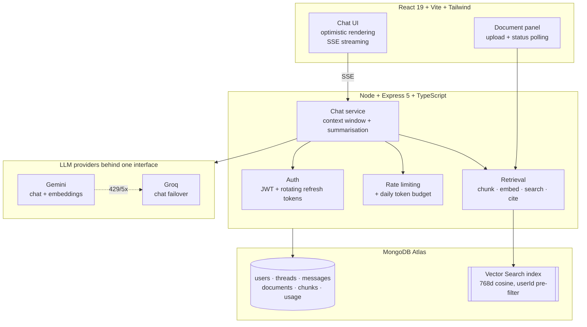

# PaperTrail

[](https://github.com/Tha1kur/papertrail/actions/workflows/ci.yml)


Ask questions about your own documents and get answers with citations you can check.

Upload a PDF or a set of notes, ask a question in plain language, and every answer
comes back with the passage it was drawn from — file name, page number, and a
relevance score. When the documents do not contain the answer, it says so instead
of inventing one.

> **Live:** _(add your URL once deployed)_
> **Stack:** TypeScript · Node · Express · MongoDB Atlas Vector Search · React 19 · Tailwind

---

## Why this exists

A general chat assistant answers from what it absorbed during training. It cannot
tell you what is in *your* handbook, *your* lecture notes, or *your* contract —
and when asked, it will often produce something plausible and wrong.

PaperTrail answers only from documents you have given it, and shows its working.

---

## Architecture



**Request path for one question:** authenticate → rate limit → check daily budget →
embed the question → vector search scoped to the user → filter by relevance →
assemble a token-budgeted context window → stream the reply → persist it with its
citations → record token spend.

---

## Engineering notes

The decisions worth explaining, and why.

### Retrieval

**Chunk size was measured, not guessed.** Chunk size is the biggest single lever on
retrieval quality. Running the eval harness at three settings:

| target chars | chunks | passed | recall@6 | MRR | refused by threshold |
| --- | --- | --- | --- | --- | --- |
| 1200 | 2 | 14/15 | 91.7% | 0.917 | 2/3 |
| **700** | **4** | **15/15** | **100%** | **0.917** | **2/3** |
| 450 | 6 | 15/15 | 100% | 0.875 | 1/3 |

At 1200 a whole document landed just under the target and became a single chunk
spanning three unrelated topics — its embedding averaged all of them and matched
none sharply. At 450 recall recovers but precision drops, and more of the work of
rejecting bad questions shifts from the relevance threshold onto the model
declining, which is the weaker defence.

**The relevance threshold is on a scale that surprises people.** Atlas reports
cosine similarity rescaled to `(1 + cos) / 2`, so **0.5 means orthogonal**, not
zero. A threshold of 0.55 looks conservative and accepts nearly everything.
Measured on a sample corpus: on-topic ≈ 0.88, off-topic ≈ 0.75, nonsense ≈ 0.77 —
note that nonsense scored *above* coherent off-topic questions, a reminder that
this measures embedding proximity, not relevance.

**Embeddings are asymmetric.** The same text embedded as a query and as a stored
passage produces different vectors, and the models are trained so a query vector
lands near the document vectors that answer it. Using the wrong task type is a
silent quality regression that still returns plausible-looking results.

**Tenant isolation is a pre-filter inside the vector index**, not a filter applied
afterwards. Retrieving the global top-k and discarding other users' chunks would
both leak through result counts and starve the user's own results — their best
match might be rank 200 globally and never surveyed at all.

### Data model

Messages and chunks live in their own collections rather than embedded in their
parent. A BSON document caps at 16MB, and both arrays are unbounded — a long
enough conversation simply stops being saveable, and it fails on a message the
user has already sent. Splitting them costs single-document atomicity, which the
repository layer buys back with transactions where it matters.

Pagination is keyset, not `skip`/`limit`. Offset pagination is O(n) in the offset
and shifts under concurrent writes, silently skipping or repeating items — which
in a chat log is not an edge case.

### Auth

Access tokens are short-lived JWTs in httpOnly cookies; refresh tokens are opaque
random values stored as SHA-256 hashes and **rotated on every use**. Because they
rotate, each should be presented exactly once — so a replayed token means two
parties hold the same credential, and the entire session family is revoked.

Tokens live in cookies rather than `localStorage`, which any script on the page can
read: one XSS in any dependency would otherwise be total account takeover.

The login endpoint compares against a dummy hash when the account does not exist,
so "no such user" and "wrong password" cost similar time and return an identical
message. Otherwise the form is an account enumeration oracle.

### Resilience

Two providers sit behind one interface, with automatic failover on retryable
errors only — failing over on a 401 would burn the fallback's quota because of a
typo. **Streaming failover stops once a token has been emitted**: switching
mid-stream would splice two different answers together.

This is not theoretical. During an eval run Gemini returned 429 (the free tier
allows 20 requests per minute) and Groq served the remainder transparently.

Rate limiting uses a sliding window, not a fixed one — a fixed window lets a caller
spend the full allowance at the end of one window and again at the start of the
next, doubling the rate exactly at the boundary, which is when a retry storm
arrives.

---

## Running it

**Prerequisites:** Node 22+, and free accounts for
[MongoDB Atlas](https://mongodb.com/cloud/atlas) (M0),
[Google AI Studio](https://aistudio.google.com/apikey) and
[Groq](https://console.groq.com). No payment details required for any of them.

```bash
git clone https://github.com/Tha1kur/papertrail.git && cd papertrail

# API
cd server
npm install
cp .env.example .env          # fill in MONGODB_URI, GEMINI_API_KEY, GROQ_API_KEY
openssl rand -base64 48       # paste as JWT_ACCESS_SECRET
npm run ensure-index          # creates the Atlas Vector Search index (idempotent)
npm run dev

# Web client, in a second terminal
cd client
npm install
npm run dev                   # http://localhost:5173
```

The server refuses to start on invalid configuration and names the offending key,
rather than failing later on the first request that happens to need it.

### With Docker

```bash
export GEMINI_API_KEY=... GROQ_API_KEY=... JWT_ACCESS_SECRET=$(openssl rand -base64 48)
docker compose up --build
```

Brings up MongoDB as a single-node replica set (transactions require one) and the API.

---

## Tests

```bash
npm test                # 70 tests, offline, ~5 seconds
npm run test:coverage
npm run eval            # retrieval quality against the real APIs
```

Two suites, deliberately separate. `npm test` runs against an in-memory MongoDB
**replica set** and a fake language model: offline, deterministic, free, and safe
on every commit. The in-memory database is a replica set rather than a standalone
because the code uses transactions — and testing against something structurally
unlike production is how a green suite ships a broken deploy.

`npm run eval` scores retrieval against real APIs on a fixed question set — recall,
MRR, and whether unanswerable questions are correctly refused. Every fact in that
set is invented, so a correct answer proves retrieval worked rather than proving
the model is well-read.

---

## Known limitations

Stated plainly, because pretending otherwise is worse.

- **No query rewriting.** A follow-up like "what about the second one?" retrieves
  poorly, because the embedding of a pronoun matches nothing. The fix is an extra
  model call per turn to rewrite the question against the conversation.
- **No OCR.** A scanned PDF has no text layer; the upload is rejected with an
  explanation rather than silently indexed as empty.
- **Uploads are held in memory** between the response and background processing.
  A restart mid-processing loses the buffer and marks the document failed. Object
  storage plus a real queue is the scalable answer, and is neither free nor yet
  warranted.
- **Rate limiting falls back to in-memory** without Upstash configured, which is
  correct on a single instance and wrong on two — each keeps its own tally.
- **Reranking would likely beat further threshold tuning.** A cross-encoder over
  the top 20 candidates is the standard next step for retrieval precision.

---

## Project origin

This began as a MERN chat clone from a course project, kept as the first commit and
tagged `baseline-scaffold` so the difference is inspectable:

```bash
git diff baseline-scaffold..HEAD --stat
```

Everything after that commit — the TypeScript rewrite, the retrieval pipeline,
authentication, the provider abstraction, the test and eval suites, and the
frontend — is my own work.
